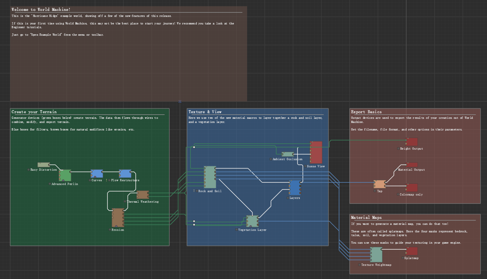

# 工作流 - Workflow
---

**工作流（workflow）** 是通过数据线连接起来的具有一定先后关系和逻辑结构的一组[设备]({{ '/zh/concept/device/' | relative_url }})的集合，它在[工作视图（链接缺失）]()中以可视化的方式显示。下图是默认工程的工作流：

**数据线（wire）** 是工作流中用于表示数据传递方向的界面元素。一条数据线连接两个端口，其一端连入某设备的输出端口，另一端连入另一设备的输入端口，表示数据从前者输出并流向后者。
- 在一条数据线上，上游提供数据的设备称为数据接收方的**前驱设备**（或**直接前驱设备**）；
- 下游接收数据的设备称为数据提供方的**后继设备**（或**直接后继设备**）。

在更广义的层面上：
- 一个设备的所有直接前驱设备，以及这些前驱设备的前驱设备（递归类推），统称为该设备的**前驱设备集合**；
- 其中，不属于直接前驱设备的部分，称为该设备的**祖先设备**。
- 一个设备的所有直接后继设备，以及这些设备的后继设备（递归类推），统称为该设备的**后继设备集合**；
- 其中，不属于直接后继设备的部分，称为该设备的**子孙设备**。

**数据链（data chain）** 指的是由设备及其数据线依次相连而形成的有向路径。它需要满足**无环性约束**——任意数据链不得形成闭合回路，即**设备图必须是有向无环图（DAG）**：
- 这意味着不存在某设备经由若干数据线再次成为其自身的前驱设备。
- 该约束保证了数据依赖关系的单向性和构建过程的可行性。

**路由节点（route point）** 是工作视图中用于整理数据线的工具。路由节点不影响工作流的逻辑结构，仅起到美观作用，可以用来梳理项目中过于繁杂的数据线。路由节点将一系列具有同一前驱设备的数据线聚集成束，该前驱设备也称为路由节点的前驱设备；当将路由节点连接到一个输入端口时，等同于将该输入端口直接连接到该路由节点的前驱设备；当将路由节点连接到一个输出端口时，等同于将连接到该路由节点上的所有输入端口都连接到了这个输出端口。

**有效链接**指的是：当一个输入端口通过数据线接收的数据非空，且该数据类型能为其所接受，则称该端口被有效链接。

---
## 构建顺序

设备的[构建（链接缺失）]()需要满足一定的逻辑条件。一个内置设备可以被构建，当且仅当满足以下任一条件：
- **条件一**：
    - 提供输入的端口均有效链接；
    - 所有直接前驱设备均已构建；
    - 无必要输入，或所有必要输入均已提供。
- **条件二**：
    - 无需前驱设备；
    - 无前驱设备。

**自定义设备的可构建性......（TODO）**

当尝试构建某个设备（称为**目标设备**）时：
1. 构建系统首先取出目标设备及其所有前驱设备，形成一个**构建集合**；
2. 从该集合中依次检查各设备的可构建性：
    - 若某设备满足构建条件，则视为已构建，将其从集合中移除，并追加到**构建序列**的尾部；
3. 重复上述过程，直到构建集合为空；
4. 最终按照构建序列的顺序逐一完成设备的构建。

当用户请求同时构建多个设备（例如点击“构建全部”按钮）时，构建系统会抽取这些设备及其前驱设备，形成一个有向无环图。通过上述过程得到的构建序列，得到该设备图的一个拓扑排序。拓扑排序通常并不唯一，因此在不同情况下可能得到不同的构建顺序，但所有结果都是等价的，均能保证正确的构建流程。

