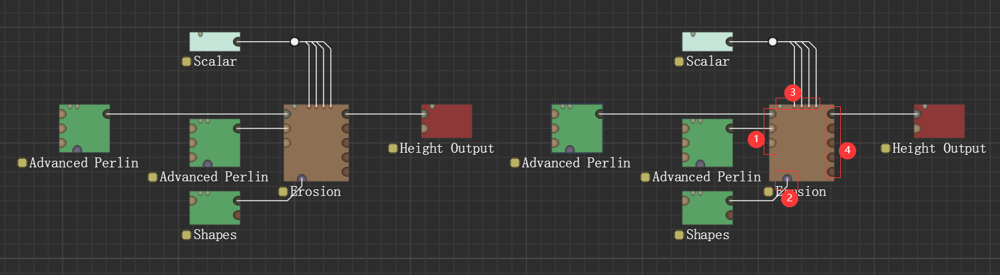
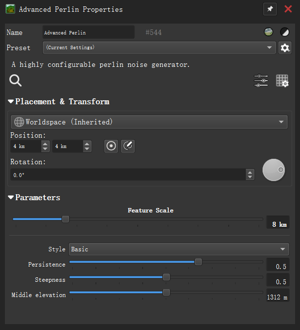
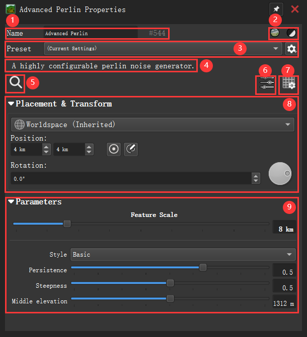

# 设备 - Device
---
**设备（Device）** 是构建WM工作流的基本构件单位。有时我们也称它们为节点（Node），代表着某种特定的操作、数据源、滤镜或输出方式。整个地形生成过程实质上就是由设备之间的数据流动构成的。

**设备**是WM对特定算法/操作的封装，它对用户暴露的接口主要是**端口（Port）** 和**参数（Parameter）**。其中端口指示数据的来源或去向，参数指定作用效果的强度、方式等等。

**高级参数（Advanced Parameters）** 是默认不显示在属性面板中的参数，高级参数显示仅当属性面板中的“显示高级参数”选项被勾选。

**内置设备（Internal Devices）** 是WM内置提供的设备。**自定义设备**是用户封装的，或是第三方提供的设备，例如宏、
  代码&nbsp;&nbsp;&nbsp;&nbsp;HR-4041 起
、由插件提供的设备（过时）等。

通常来说，数据从设备的左侧流入，经过处理后，结果从右侧流出。有些设备仅有输出、没有输入，它们通常从无开始生成一个新的数据，或是指定文件系统中的一个数据源读入到工作流中；有些设备仅有输入、没有输出，它们通常是将工作流中的数据写入文件系统；还有些特殊的设备，它们既没有输入也没有输出，它们通常应用于在一些特殊场景中进行设置。

设备在工作视图中表现为一个带引脚的方块，其下方标注了[设备状态](#设备状态)和设备名称。在工作视图或设备列表中双击设备，或右键设备并从右键菜单栏中选择编辑属性，可以唤出设备的[属性面板](#属性面板)。鼠标浮于设备之上时，设备的下方将显示设备的详细信息（包括当前构建的分辨率、内存占用、构建耗时和提示信息（如果有）），单击选中该设备以使详细信息常驻显示。

## 分类

设备大致可分为以下几类：
- **生成器（Generator）**：从无开始生成高度场，通常是创建地形或遮罩的起点。
- **输出器（Output）**：将结果输出为图像或导出文件。
- **预览（View）**：将遮罩、材质、光照等与地形组合后的效果预览。
- **合成器（Combiner）**：将多个地形或数据以某种方式混合。
- **过滤器（Filter）**：对高度场应用某种算法过滤后输出。
- **自然化（Nature）**：应用特定算法以模拟自然现象。
- **选择器（Selector）**：根据条件在多个输入间切换或混合。
- **材质（Material）**：主要提供各种生成、处理材质的操作。
- **参数（Parameter）**：主要提供各种生成、处理参数的操作。
- **曲线（Curve）**：主要提供各种生成、处理曲线的操作
- **实用工具（Utility）**：用于数据控制、逻辑判断、宏、
  代码&nbsp;&nbsp;&nbsp;&nbsp;HR-4041 起
等辅助功能。

模块的颜色通常与模块的类别或功能相关联（虽然这一规则在内置设备中并没有被严格遵循），通常有：，，，，，，，，，，-95a486?labelColor=95a486&color=95a486&style=flat&label=)

## 引脚

设备四周的缺口称为**端口（Port）**，也被称为引脚，它们按功能划分并放置在设备的四周：
- 左侧-输入端口
- 上侧-扭曲端口/参数端口
- 下侧-遮罩端口
- 右侧-输出端口

广义上来讲，输入端口、扭曲端口/参数端口、遮罩端口都属于输入端口的一种，它们位于数据线的下游，接受数据而不生产数据，仅能连接一条数据线。一个常见的设备的引脚结构形如上图：
- **\[1\]** 输入端口：通常是模块的主要输入，以及任何需要的辅助数据输入；我们人为的将它们分为：
	- 必要输入：必须要为这些端口提供一个输入，当所有必要输入端口全部<a herf="#有效链接">有效链接</a>时，设备才能正常运行。在输入引脚中，必要输入通常用深色引脚标记。
	- 可选输入：连接这些输入不是必须的，可以不为这些端口提供输入。
- **\[2\]** 遮罩端口：指示该模块应当仅作用于给定遮罩所规定的区域。
- **\[3\]** 扭曲端口：通常位于设备上侧从左向右的第一个端口，它接受一个**扭曲（链接缺失）**，指示设备处理结果应当按此方式扭曲后输出。
- **\[4\]** 参数端口：通常位于扭曲端口之后（如果有），参数端口的类别通常与设备参数面板中的参数一一对应，其目的是允许通过外部数据控制设备参数，当参数端口被有效链接（链接缺失）时，参数面板中的对应参数将失效，其控制权移交给外部数据源；当一个参数端口未曾连接到任何数据线时，该端口默认隐藏；要将数据线连接到一个参数端口，应当拖动数据线末端至设备上后松开，此时菜单中将显示所有可用参数，选择后即可连接。
- **\[5\]** 输出端口：输出设备的任何结果数据，其主要输出通常用深色引脚标记。

输出端口输出设备的任何结果，它们是数据源，每个输出端口可以连接多条数据线，这意味着它们的数据可以被多处使用。

每个端口都与一个或多个**数据类型（链接缺失）** 相关联：对于一个输入端口来说，它接受一种或几种数据类型，只有这些类型的数据源才可以通过数据线连接至此；对于输出端口来说，根据参数设置的不同，它可能输出一种或几种的数据，并作为该种类型的数据源，在同等条件（连接缺失）下一个输出端口仅能输出一种数据类型。当一个输入端口通过数据线接收的数据非空，且该数据类型能为其所接受，则称该端口被**有效链接**。

当一个设备没有输入端口或没有必要输入端口时，则称该设备是**无需输入**的。

当鼠标浮于端口上时，设备上方将显示该端口的名称以及其接受/提供的数据类型。

## 属性面板

在工作视图或设备列表中双击设备，或右键设备并从右键菜单栏中选择编辑属性，可以唤出设备的属性面板。

一个典型的属性面板形如下图：

<table style="width: 100%;">
  <tr>
    <td style="width: 50%; text-align: center;">
      
    </td>
    <td style="width: 50%; text-align: center;">
      
    </td>
  </tr>
</table>

+ **\[1\]** 设备的名称和ID，其中名称是可修改的，在工作视图显示在设备的下方，默认是设备名；ID是该设备的全局唯一的索引。
+ **\[2\]** 两个互斥的复选框，强制要求该设备的输出以地形/遮罩方式渲染。
+ **\[3\]**  选择参数预设（链接缺失），保存、删除、重命名当前预设。
+ **\[4\]** 关于该设备的一段简短描述。
+ **\[5\]** 找到当前设备在并使工作视图聚焦于该设备。
+ **\[6\]** 复选框，选中时将在面板中显示高级参数。
+ **\[7\]** 按钮，唤出覆写分辨率面板（链接缺失），其效果等同于在设备的右键菜单栏中选择对应选项。  
+ **\[8\]**  置于&变换，设置设备作用于Worldspace或Localspace（链接缺失）、位于坐标系的何处、旋转角度等等，具体参见此处（链接缺失）。
+ **\[9\]** 取决于设备而各异的参数，控制设备本身的行为。 

## 设备状态

**设备状态**是指示设备在当前构建中构建情况的指标，它显示在设备名称之前，表现为一个带颜色的小方块，其中不同的颜色代指不同的状态：
- 预览
- 预构建
- 已构建
- 已抛弃
- 失效
- 禁用
- 短路

